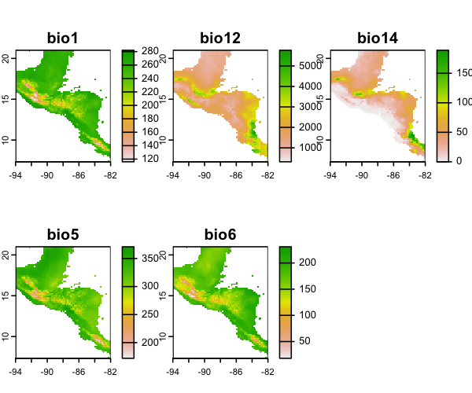
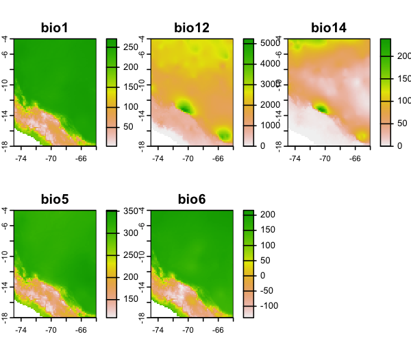
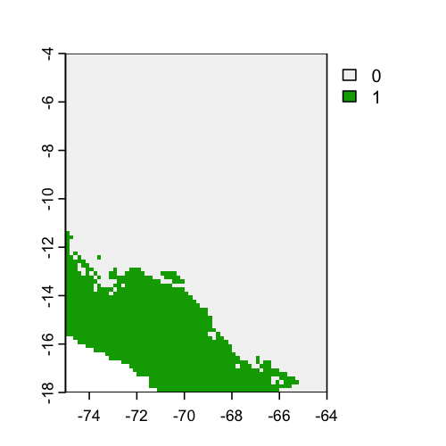
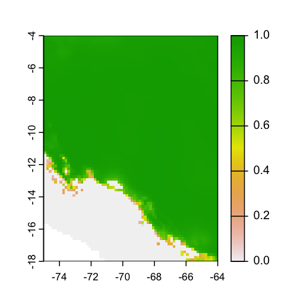

<!-- badges: start -->
[](https://github.com/luismurao/smop/actions/workflows/R-CMD-check.yaml)
[](https://app.codecov.io/gh/luismurao/smop?branch=main)
<!-- badges: end -->

# smop <a href="https://luismurao.github.io/smop/"></a>
 
 The `smop` package is a small R package (it has two main functions) designed 
 to perform the Mobility-Oriented Parity analysis (MOP) both in fast fashion 
 and taking care of memory usage. To do this it uses optimized `C++` code via
 the [`Rcpp`](https://cran.r-project.org/package=Rcpp) and 
 [`RcppArmadillo`](https://cran.r-project.org/package=RcppArmadillo) 
 packages. 

 The MOP test was proposed in 
 [Owens et al. 2013](https://doi.org/10.1016/j.ecolmodel.2013.04.011) to 
 estimate regions where extrapolation occurs (Figure 1). 
 
 ](man/figures/Extrapolation_01.jpg)
 
## Installation

::: {.pkgdown-devel}
You can install the development version of `smop` from GitHub with:
`remotes::install_github("luismurao/smop")`
:::

## Example of use

First we estimate zones where strict extrapolation occurs. To show this, we
read environmental data from the calibration and the transfer zones. 

``` R
m_path <- system.file("extdata/M_layers", package = "smop") |>
                       list.files(full.names=TRUE)
g_path <- system.file("extdata/G_layers", package = "smop") |>
                       list.files(full.names=TRUE)
M_calibra <- terra::rast(m_path)
G_transfer <- terra::rast(g_path)
```

Calibration area

```R
terra::plot(M_calibra)
```


Model transfer area

```R
terra::plot(G_transfer)
```


Zones where strict extrapolation occurs.

```R
extr_zones <- smop::extrapolation_zones(M_calibra = M_calibra,
                                        G_transfer = G_transfer,
                                        as_vec =FALSE)
terra::plot(extr_zones)
```


#### The MOP analysis

Now we perform the mop analysis 

```R
# Example 1 compute mop distance in serial
mop_test <- smop::mop(M_calibra = M_calibra, G_transfer =  G_transfer,
                      percent = 10,comp_each = NULL,
                      normalized = TRUE, standardize_vars=TRUE)
terra::plot(mop_test)
```


##### Parallel MOP

The MOP analysis can be performed in parallel by evoking functions from the 
[`furrr`](https://furrr.futureverse.org/articles/progress.html) R package. 
Here, we use the *comp_each* parameter to specify the number of pixels to be 
processed in each CPU core. The number of pixels to be processed in each CPU 
core depends on the user's RAM memory; if the user has a computer with few RAM, 
it is recommended to process by 500 pixels, otherwise, it can be as high 
as 10,000 pixels. An improvement from other versions of  the *mop* function 
such as the [`ntbox`](https://github.com/luismurao/ntbox/tree/master) 
and the [`kuenm`](https://github.com/marlonecobos/kuenm), is that the 
performance of the function is less affected by the parametrization of 
the *comp_each* parameter.

```R
# Example 2: Run the mop function in parallel
future::plan("future::multisession",workers = 2)
mop_test_parallel <- smop::mop(M_calibra = M_calibra,
                               G_transfer =  G_transfer,
                               percent = 10,comp_each = 500,
                               normalized = TRUE, standardize_vars=TRUE)
future::plan("future::sequential")
terra::plot(mop_test_parallel)
```

In fact, the better management of memory and the optimization of the code 
allows users to run MOP analyses on huge extents such as the whole world. Here,
we show how to run the MOP using the bioclimatic variables for the current time 
at 10 arc minutes and an climate change scenario.

First, we downloaded the climatic layer for whole world and the current time at
10 arc minutes. Then, we downloaded the climate change layers. Finally, we run
the MOP analysis in a parallel fashion using 20 cores.

```R
bio10_pre <- geodata::worldclim_global("bioc",res=10,path = tempdir())
bio10_fut <- geodata::cmip6_world("CNRM-CM6-1", "585", "2061-2080",
                              var="bioc", res=10, path=tempdir())

mop_time <- system.time({
  future::plan("future::multisession",workers = 20)
  mop_basic_res1 <- smop::mop(M_calibra = bio10_pre[[c(1,5,6,12,15)]],
                              G_transfer = bio10_fut[[c(1,5,6,12,15)]],
                              comp_each = 10000,
                              percent = 50,standardize_vars = TRUE,
                              normalized = TRUE)
  future::plan("future::sequential")
})

mop_time
#>     user   system  elapsed 
#>  420.586   15.776 2781.064 
```

This process took about 46 minutes which seems to be a lot of time but note
that this analysis was done for the whole world! Moreover, this kind of
MOP analysis wont run on other packages. 

